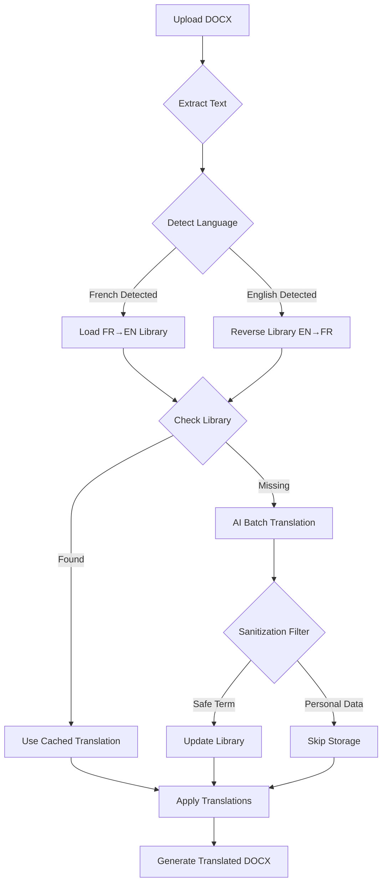

# Professional Resume Translator 🚀

A robust, production-ready system to translate resumes between **French** and **English** while perfectly preserving formatting, styles, and layouts.

---

## 🌟 Key Features

### Bidirectional Translation
- **Auto-Detection**: Instantly identifies if your resume is French or English
- **Smart Translation**: FR → EN or EN → FR with a single click
- **Intelligent Library**: 500+ curated professional terms with reverse lookup capability

### Privacy & Security
- **Strict Sanitization**: Personal data (emails, phone numbers, dates) never stored in the library
- **Auto-Cleanup**: All uploaded files deleted after 60 seconds
- **Audit Logging**: Every action tracked for transparency

### Format Preservation
- **Perfect Fidelity**: Maintains all fonts, tables, charts, and complex layouts
- **XML-Level Processing**: Direct manipulation of DOCX structure for accuracy

---

## 🏗️ System Architecture



### Language Detection Heuristic
The system analyzes the first 2000 characters and counts keyword occurrences:
- **French signals**: "expérience", "formation", "compétences", "résumé", "janvier", etc.
- **English signals**: "experience", "education", "skills", "summary", "january", etc.

If scores are tied, it checks for common words ("et"/"le" vs "and"/"the").

---

## 🛠️ Setup & Installation

### For Linux / WSL (Ubuntu)
```bash
# 1. Prepare environment
chmod +x setup_requirements.sh
./setup_requirements.sh

# 2. Start the web server
./start_server.sh
# Runs with 2 concurrent workers, 300s timeout
```

### For Windows
```batch
# 1. One-time setup
Double-click: setup_windows.bat
# Creates venv_win and installs dependencies

# 2. Start web application
Double-click: start_server_windows.bat
# Opens Flask server at http://localhost:5000

# 3. CLI translation (alternative)
Drag your .docx file onto: run_cli_windows.bat
# Translates and saves in same folder
```

**Note**: All Windows scripts automatically detect their location, so they work from any folder.

---

## 🚀 Usage Guide

### Option 1: Web Application
**URL**: [http://localhost:5000](http://localhost:5000)

1. Open the web interface
2. Drag & drop your resume (FR or EN)
3. The app auto-detects language and translates
4. Download the result automatically

**Example**:
- Upload: `CV_Papa_Diop_FR.docx` → Download: `CV_Papa_Diop_EN.docx`
- Upload: `Resume_John_Smith_EN.docx` → Download: `Resume_John_Smith_FR.docx`

### Option 2: Command Line (CLI)
```bash
# Auto-detects language and translates
./venv/bin/python3 run_translation_pipeline.py "path/to/resume.docx"
```

**Examples**:
```bash
# French to English
./venv/bin/python3 run_translation_pipeline.py "CV_2024_FR.docx"
# Output: CV_2024_EN.docx

# English to French
./venv/bin/python3 run_translation_pipeline.py "Resume_2024_EN.docx"
# Output: Resume_2024_FR.docx
```

### Option 3: Windows Native (Drag & Drop)

**Web Application**:
1. Double-click `start_server_windows.bat`
2. Browser opens automatically to `http://localhost:5000`
3. Drag & drop your resume (FR or EN)
4. Download translated file

**CLI Translation**:
1. Drag your `.docx` file onto `run_cli_windows.bat`
2. Console shows progress (language detection, AI batches)
3. Translated file appears in same folder
4. Window closes when complete

**Example**: Drag `CV_2024_FR.docx` onto the batch file → Get `CV_2024_EN.docx` in the same location

---

## 🛡️ Privacy & Sanitization

### What Gets Stored in the Library
✅ **Generic professional terms**: "Experience", "Python", "Project Manager"

### What Never Gets Stored
❌ **Email addresses**: `user@example.com`  
❌ **Phone numbers**: `+1-555-0123`  
❌ **Dates & Numbers**: `2024`, `5 years`, `123 Main St`  
❌ **Long sentences**: Anything over 5 words  

This ensures your `master_library.json` remains a clean, reusable knowledge base.

---

## 📂 Project Structure

```
resume_translator_project/
├── app.py                      # Flask backend with auto-detection
├── run_translation_pipeline.py # Core translation engine (CLI)
├── master_library.json         # 500+ professional terms (FR→EN)
├── static/
│   ├── index.html             # Modern web interface
│   └── style.css              # Glassmorphism design
├── setup_windows.bat          # Windows setup script
├── run_cli_windows.bat        # Windows drag-and-drop runner
├── setup_requirements.sh      # Linux/WSL setup
└── start_server.sh            # Production server launcher
```

---

## 🔧 Production Configuration

### Linux/WSL
- **Server**: Gunicorn with 2 workers
- **Timeout**: 300 seconds (handles large files)
- **File Retention**: 60 seconds auto-cleanup
- **Logging**: All uploads tracked in `uploads.log`

### Windows
- **Server**: Flask development server (simple, reliable)
- **File Retention**: 60 seconds auto-cleanup
- **Logging**: All uploads tracked in `uploads.log`

---

## 🗺️ Roadmap

- [ ] **Offline AI Translation**: Migrate to Hugging Face Transformers (no API limits)
- [ ] **Multi-language Support**: Add German, Spanish, Italian
- [ ] **PDF Direct Translation**: Preserve PDF layouts natively

---

*Developed by Papa Samba Diop - Optimized for Professional Engineering & Management Profiles*
