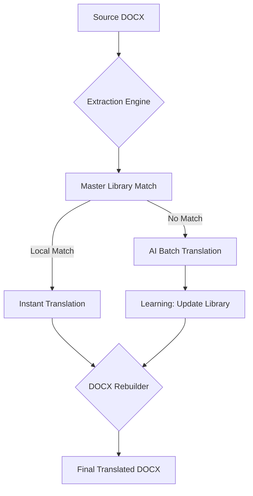

# Professional Resume Translator 🚀

A robust, production-ready ecosystem designed to translate French resumes to English while perfectly preserving complex layouts, tables, and formatting.

---

## 🏗️ System Architecture

Our platform uses a **three-layered** approach to ensure the highest quality results:



---

## ⚡ The 3 Translation Options

Regardless of the option you choose, the translation logic remains consistent, utilizing our **Smart Library** (500+ pre-filled terms) and **AI Batching**.

### 1. Modern Web Application (Linux/WSL)
*Best for: Users who prefer a visual, interactive experience.*

**Visual Preview:**
> The web interface features a **Glassmorphism Design** with smooth purple/blue gradients. It includes a central drag-and-drop zone and a real-time progress tracker.

**Steps:**
1.  **Initialize**: Run `./setup_requirements.sh` (installs Flask, Gunicorn, and dependencies).
2.  **Launch**: Run `./start_server.sh`.
3.  **Use**: Open `http://localhost:5000` in your browser.
4.  **Action**: Drag your French DOCX onto the screen. The translated file will download automatically once the AI finishes.

---

### 2. Command Line Interface - CLI (Linux/WSL)
*Best for: Developers, power users, and automation.*

**Features:**
- **Automatic detection**: Identifies new strings and handles AI translation without user input.
- **Detailed Logging**: See the progress of AI batches in your terminal.
- **Absolute Path Support**: No matter where you are, the script finds its library.

**Commands:**
```bash
./venv/bin/python3 run_translation_pipeline.py "/path/to/resume_FR.docx"
```
*The output file will be created in the same folder as the source.*

---

### 3. Windows Native "No-Terminal" (Drag & Drop)
*Best for: Users on a standard Windows PC without WSL or terminal knowledge.*

**Visual Preview:**
> Simply look for a file with a gear icon or a command prompt icon named `run_cli_windows`.

**Steps:**
1.  **First Time Setup**: Double-click **`setup_windows.bat`**. This creates a private Windows environment (`venv_win`).
2.  **Translation**: Drag any French `.docx` file and drop it directly onto the **`run_cli_windows.bat`** file.
3.  **Result**: A console window will pop up showing the progress and will close automatically when the new CV is ready.

---

## 📂 Project Structure

| File | Description |
| :--- | :--- |
| **`app.py`** | Production Flask server with Gunicorn support. |
| **`run_translation_pipeline.py`** | The automated core translation engine. |
| **`master_library.json`** | Cleaned knowledge base with 500+ professional terms. |
| **`start_server.sh`** | High-performance runner (4 workers, 300s timeout). |
| **`setup_windows.bat`** | One-click environment builder for Windows. |
| **`run_cli_windows.bat`** | The Drag-and-Drop runner for Windows. |

---

## 🛡️ Production Hardening & Privacy

- **Concurrency**: Powered by **Gunicorn** to handle multiple concurrent tasks.
- **Timeout Protection**: 300-second timeout ensures even the largest CVs finish translating.
- **Security**: Uploaded files and maps are automatically deleted after **60 seconds** to protect your privacy.
- **Audit Logging**: Every action is recorded in `uploads.log`.

---

## 🗺️ Roadmap
- [ ] **Offline AI**: Migration to Hugging Face Transformers for 100% local translation.
- [ ] **PDF Support**: Direct PDF-to-PDF translation layout preservation.

---
*Developed by Papa Samba Diop - Tailored for Professional Engineering and Management Profiles.*
